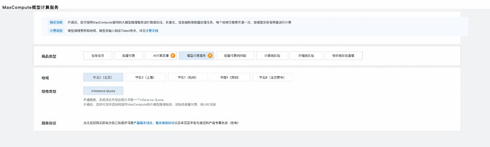

.. _examples_ai_function_bailian_demo:

Bailian LLM Calling Tutorial
============================

.. raw:: html

   
Available at MaxFrame 2.6.0

This tutorial explains how to access models in the Bailian public modelset from MaxFrame and run both text embedding and text generation workloads on DPE.

Key tasks covered:

- Browse available models in ``BIGDATA_PUBLIC_MODELSET``.
- Inspect model metadata and inference parameters.
- Run text embedding inference with ``embed()``.
- Run text generation inference with ``generate()``.
- Persist outputs to MaxCompute tables.

Prerequisites
-------------

.. list-table::
   :header-rows: 1
   :widths: 8 30 62

   * - #
     - Requirement
     - Description
   * - 1
     - **MaxCompute enabled**
     - You need a MaxCompute project with valid Access ID / Access Key.
   * - 2
     - **DPE engine enabled**
     - Bailian AI Function calls in this workflow run through DPE.
   * - 3
     - **Model compute service purchased**
     - Purchase model compute service in MaxCompute console; an inference quota is created and billed by usage.
   * - 4
     - **Supported region**
     - Ensure your MaxCompute project is in a region where Bailian model services are available.
   * - 5
     - **Python version**
     - Python 3.11 is recommended.
   * - 6
     - **MaxFrame SDK version**
     - Use MaxFrame SDK **2.6.0** or above (``pip install maxframe>=2.6.0``).

Model compute service and inference quota
-----------------------------------------

In MaxCompute console, purchase/enable model compute service and confirm the associated inference quota before running Bailian model inference.

1. Environment setup and session creation
-----------------------------------------

Check MaxFrame version:

.. code-block:: python

   import maxframe

   assert maxframe.__version__ >= "2.6.0", (
       f"maxframe >= 2.6.0 is required, current version: {maxframe.__version__}. "
       f"Please run: pip install --upgrade maxframe"
   )
   print(f"maxframe version: {maxframe.__version__} ✓")

Imports:

.. code-block:: python

   import logging

   import pandas as pd
   import maxframe.dataframe as md
   from maxframe import new_session
   from maxframe.config import options
   from maxframe.learn.utils import read_odps_model
   from odps import ODPS

   logging.basicConfig(level=logging.INFO)
   pd.set_option("display.max_colwidth", None)
   pd.set_option("display.max_columns", None)

Configure engine and create session:

.. code-block:: python

   o = ODPS(
       access_id="<your_access_id>",
       secret_access_key="<your_access_key>",
       endpoint="https://service.<region>.maxcompute.aliyun.com/api",
       project="<your_project_name>",
   )

   options.dag.settings = {"engine_order": ["DPE", "MCSQL"]}
   options.session.inference_quota_name = "<your_inference_quota_name>"

   session = new_session(o)
   print(f"Session ID : {session.session_id}")
   print(f"LogView    : {session.get_logview_address()}")

.. note::

   Keep the LogView URL for troubleshooting. It is the main entry for worker logs and runtime diagnostics.

2. Browse Bailian public modelset
---------------------------------

.. code-block:: python

   available_models = list(o.list_models(project="bigdata_public_modelset"))
   print(f"Available model count: {len(available_models)}")
   for m in available_models:
       print(f"  - {m.name}")

3. Inspect model details
------------------------

.. code-block:: python

   model = o.get_model("text-embedding-v4", project="bigdata_public_modelset")

   print(f"name: {model.name}")
   print(f"type: {model.type}")
   print(f"source_type: {model.source_type}")
   print(f"options: {model.options}")
   print(f"_feature_columns: {model._feature_columns}")
   print(f"inference_parameters: {model.inference_parameters}")
   print(f"_labels: {model._labels}")

4. Text embedding inference
---------------------------

Load embedding model:

.. code-block:: python

   embedding_model = read_odps_model("text-embedding-v4", project="bigdata_public_modelset")
   print(embedding_model)

Prepare input data:

.. code-block:: python

   query_list = [
       "What is the average distance from Earth to the Sun?",
       "When did the American Revolutionary War begin?",
       "What is the boiling point of water?",
       "How can I quickly relieve a headache?",
       "Who is the main character in Harry Potter?",
   ]

   df = md.DataFrame({"query": query_list})

Run ``embed()``:

.. code-block:: python

   # simple_output=True returns the raw embedding data directly,
   # skipping provider response metadata.
   embedding_result = embedding_model.embed(
       df["query"],
       simple_output=True,
   )

   print("Output dtypes:")
   print(embedding_result.dtypes)

Execute:

.. code-block:: python

   embedding_executed = embedding_result.execute()
   print("Embedding result:")
   print(embedding_executed)

5. Text generation inference
----------------------------

Load generation model:

.. code-block:: python

   gen_model = read_odps_model("qwen3-max", project="bigdata_public_modelset")
   print(gen_model)

Build prompt and run:

.. code-block:: python

   messages = [
       {"role": "system", "content": "You are a concise and accurate QA assistant."},
       {"role": "user", "content": "{query}"},
   ]

   # simple_output=True returns the generated text directly,
   # skipping the raw provider response structure.
   gen_result = gen_model.generate(
       df,
       prompt_template=messages,
       simple_output=True,
   )

   gen_executed = gen_result.execute()
   print("Generation result:")
   print(gen_executed)

Optional persistence:

.. code-block:: python

   # md.to_odps_table(embedding_result, "bailian_embedding_results", overwrite=True).execute()
   # md.to_odps_table(gen_result, "bailian_generate_results", overwrite=True).execute()

6. Cleanup
----------

.. code-block:: python

   session.destroy()
   print("Session destroyed and resources released.")

Appendix: Bailian models vs built-in managed models
----------------------------------------------------

.. list-table::
   :header-rows: 1
   :widths: 24 38 38

   * - Item
     - Bailian pre-registered models
     - Built-in managed models
   * - Load API
     - ``read_odps_model("name", project="bigdata_public_modelset")``
     - ``ManagedTextGenLLM(name="...")``
   * - Source
     - Models registered on Bailian platform
     - MaxFrame managed model catalog
   * - Typical names
     - ``text-embedding-v4``, ``qwen3-max``
     - ``qwen2.5-1.5b-instruct``, ``DeepSeek-R1``
   * - APIs
     - ``generate()`` / ``embed()``
     - ``generate()`` / ``embed()`` / ``translate()`` / ``extract()``

Managed model example:

.. code-block:: python

   from maxframe.learn.contrib.llm.models.managed import ManagedTextGenLLM

   llm = ManagedTextGenLLM(name="qwen2.5-1.5b-instruct")
   messages = [
       {"role": "system", "content": "You are a helpful assistant."},
       {"role": "user", "content": "{query}"},
   ]
   # simple_output=True returns the generated text directly,
   # skipping the raw provider response structure.
   result = llm.generate(df, prompt_template=messages, simple_output=True)
   result.execute()

Troubleshooting
---------------

.. list-table::
   :header-rows: 1
   :widths: 28 32 40

   * - Issue
     - Cause
     - Resolution
   * - ``Engine DPE not available``
     - DPE is not enabled for the project
     - Ask your admin to enable DPE.
   * - ``Model not found``
     - Wrong model name or unsupported region
     - Check available names with ``list_models()`` and verify region support.
   * - ``inference_quota_name`` error
     - Inference quota is not configured
     - Set a valid ``options.session.inference_quota_name``.
   * - ``Session timeout``
     - Inference job timed out
     - Reduce batch size and inspect LogView logs.
   * - ``execute()`` returns nothing
     - Lazy graph has not been triggered
     - Ensure ``.execute()`` is called.
