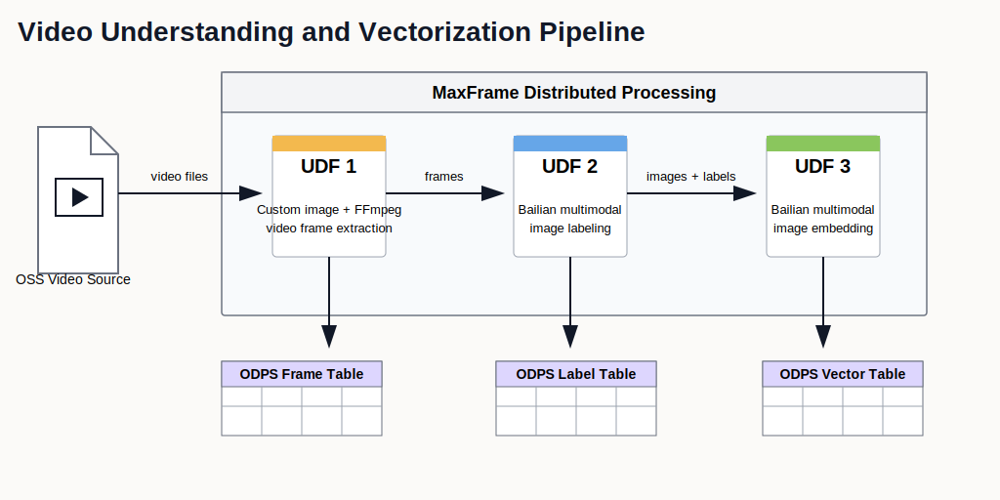

.. _examples_video_pipeline_best_practice:

Video Pipeline: Frame Extraction -> Labeling -> Embedding
=========================================================

.. raw:: html

   
Available at MaxFrame 2.6.0

Background
----------

Autonomous driving systems continuously collect large-scale camera video across road types, traffic conditions, weather, and complex events. These raw videos are critical for model training, scenario mining, data flywheel operations, and evaluation.

Raw video data is usually unstructured and expensive to curate manually. To improve reuse and retrieval efficiency, the data pipeline should standardize frame-level processing:

1. Extract keyframes from videos with FFmpeg.
2. Generate scene labels using multimodal LLMs.
3. Produce embeddings for retrieval, clustering, and sample mining.

This tutorial shows an end-to-end distributed implementation on MaxFrame.

Applicable scenarios
--------------------

- Automatic tagging and management of large video datasets.
- Similar-scene retrieval and sample recall.
- Long-tail and anomaly scenario discovery.
- Dataset clustering and distribution analysis.
- Data preparation for training and evaluation loops.

Workflow
--------

Prerequisites
-------------

.. list-table::
   :header-rows: 1
   :widths: 8 24 68

   * - #
     - Requirement
     - Description
   * - 1
     - **MaxCompute enabled**
     - A MaxCompute project with valid Access ID / Access Key.
   * - 2
     - **DPE enabled**
     - ``apply_chunk`` stages run on DPE.
   * - 3
     - **Video uploaded to OSS**
     - Source videos are stored in a target OSS bucket.
   * - 4
     - **OSS RAM role authorization**
     - Configure Role ARN for OSS mount access.
   * - 5
     - **DashScope API key**
     - Required for multimodal labeling and embedding calls.
   * - 6
     - **Custom image with FFmpeg**
     - Stage-1 extraction requires FFmpeg in a MaxCompute custom image. The image must be available in the same region as the MaxCompute project.
   * - 7
     - **MaxFrame SDK version**
     - Use MaxFrame SDK **2.6.0** or above (``pip install maxframe>=2.6.0``).

Custom image
------------

Why custom image?
~~~~~~~~~~~~~~~~~

Default DPE runtime includes Python but not FFmpeg. Stage-1 frame extraction requires FFmpeg binaries.
For a quick validation run, you can reuse an existing verified FFmpeg image
from the same region. For production, build and publish your own image in the
same region as the MaxCompute project, then set ``odps.session.image`` to that
image name.

Dockerfile example:

.. code-block:: dockerfile

   FROM registry.cn-zhangjiakou.aliyuncs.com/maxcompute_image/ubuntu_20.04:latest

   RUN apt-get update && DEBIAN_FRONTEND=noninteractive apt-get install -y \
       ffmpeg \
       && rm -rf /var/lib/apt/lists/*

   COPY ossfs2_2.0.3.1_linux_x86_64.deb /tmp/
   RUN apt install /tmp/ossfs2_2.0.3.1_linux_x86_64.deb

   WORKDIR /workspace
   ENV MF_PYTHON_EXECUTABLE="/usr/ali/python3.11.7/bin/python3"

Environment setup
-----------------

.. code-block:: python

   import glob
   import json
   import math
   import os
   import subprocess

   import numpy as np
   import pandas as pd
   import maxframe.dataframe as md
   from maxframe.config import options
   from maxframe.session import new_session
   from maxframe.udf import with_fs_mount, with_python_requirements, with_running_options
   from maxframe.dataframe.utils import parse_index
   from odps import ODPS

   options.sql.settings = {"odps.session.image": "<your_ffmpeg_image_name>"}
   options.dag.settings = {"engine_order": ["DPE", "MCSQL"]}
   options.dpe.settings = {
       "substep.internal_network_whitelist": [
           "intranet-cn-beijing.dashscope.aliyuncs.com:443",
       ],
   }

   o = ODPS(
       access_id="<your_access_id>",
       secret_access_key="<your_secret_access_key>",
       project="<your_maxcompute_project>",
       endpoint="https://service.<region>.maxcompute.aliyun.com/api",
   )
   session = new_session(o)
   print(f"Session ID : {session.session_id}")
   print(f"LogView    : {session.get_logview_address()}")

Global parameters:

.. code-block:: python

   OSS_ENDPOINT = "<your_oss_endpoint>"  # for example: oss-cn-hangzhou.aliyuncs.com
   OSS_BUCKET = "<your_oss_bucket>"
   OSS_PATH = "<your_video_prefix>/"
   ROLE_ARN = "acs:ram::<account_id>:role/<your_role_name>"

   DASHSCOPE_API_KEY = "<your_dashscope_api_key>"
   LABEL_MODEL = "qwen3-vl-plus"
   EMBEDDING_MODEL = "qwen3-vl-embedding"
   EMBEDDING_DIM = 1024

   LABEL_PROMPT = (
       "This image is captured from an autonomous driving scenario. "
       "Identify factors that may affect driving, including lane quality, signs, "
       "road conditions, obstacles, poor weather, poor lighting, complex traffic "
       "patterns, and unusual events. Provide detailed scene factors only."
   )

Make sure the mounted OSS path is correct before submitting the job. For
example, if your OSS address is ``oss://oss-cn-hangzhou.aliyuncs.com/jingxuan-oss-test-hz/``,
use ``OSS_ENDPOINT = "oss-cn-hangzhou.aliyuncs.com"``, ``OSS_BUCKET = "jingxuan-oss-test-hz"``,
and ``OSS_PATH = ""`` or the subdirectory that contains your videos.

Stage 1: frame extraction
-------------------------

.. code-block:: python

   @with_running_options(engine="dpe", cpu=1, memory=4)
   @with_fs_mount(
       path=f"oss://{OSS_ENDPOINT}/{OSS_BUCKET}/{OSS_PATH}",
       mount_path="/mnt/data",
       storage_options={"role_arn": ROLE_ARN},
   )
   def extract_frame(batch_df, fps=2, quality=2, timeout=300):
       video_extensions = (".mp4", ".avi", ".mov")
       frame_columns = ["image_oss_bucket", "image_oss_path", "image_oss_name", "size"]

       video_files = []
       for root, _, files in os.walk("/mnt/data"):
           for f in files:
               if f.lower().endswith(video_extensions):
                   video_files.append(os.path.join(root, f))

       all_results = []
       for video_path in video_files:
           video_name_no_ext = os.path.splitext(os.path.basename(video_path))[0]
           output_dir = os.path.join("/mnt/data", "output_frames", video_name_no_ext)
           os.makedirs(output_dir, exist_ok=True)

           try:
               cmd = [
                   "ffmpeg", "-i", video_path,
                   "-vf", f"fps={fps}",
                   "-q:v", str(quality),
                   "-f", "image2",
                   os.path.join(output_dir, "%04d.jpg"),
               ]
               process = subprocess.run(
                   cmd, stdout=subprocess.DEVNULL, stderr=subprocess.PIPE, timeout=timeout
               )
               if process.returncode != 0:
                   continue
           except Exception:
               continue

           for frame in sorted(glob.glob(os.path.join(output_dir, "*.jpg"))):
               rel_dir = output_dir.replace("/mnt/data/", "").rstrip("/") + "/"
               all_results.append([
                   OSS_BUCKET,
                   rel_dir,
                   os.path.basename(frame),
                   os.path.getsize(frame),
               ])

       if not all_results:
           return pd.DataFrame(columns=frame_columns)
       return pd.DataFrame(all_results, columns=frame_columns)

   seed_df = md.DataFrame(pd.DataFrame({"trigger": [1]}))
   frame_result = seed_df.mf.apply_chunk(
       extract_frame,
       output_type="dataframe",
       dtypes={
           "image_oss_bucket": np.dtype("str"),
           "image_oss_path": np.dtype("str"),
           "image_oss_name": np.dtype("str"),
           "size": np.dtype("int"),
       },
       skip_infer=True,
       index=parse_index(pd.Index([], dtype=np.int64)),
   )

   md.to_odps_table(frame_result, "mf_video_frame_result", overwrite=True, index=False).execute()

Stage 2: image labeling
-----------------------

.. note::

   At large scale, request higher API quotas to avoid 429/403 throttling.

.. code-block:: python

   @with_fs_mount(
       path=f"oss://{OSS_ENDPOINT}/{OSS_BUCKET}/{OSS_PATH}",
       mount_path="/mnt/data",
       storage_options={"role_arn": ROLE_ARN},
   )
   @with_python_requirements("dashscope>=1.24.6")
   @with_running_options(engine="dpe", cpu=1, memory=4)
   def labeling_chunk(chunk, api_key=None, model=LABEL_MODEL, prompt=None, max_tokens=250):
       import base64
       from http import HTTPStatus
       import dashscope

       dashscope.base_http_api_url = "https://intranet-cn-beijing.dashscope.aliyuncs.com/api/v1"
       _api_key = api_key or DASHSCOPE_API_KEY
       _prompt = prompt or LABEL_PROMPT

       rows = []
       for _, row in chunk.iterrows():
           try:
               img_path = f"/mnt/data/{row['image_oss_path']}{row['image_oss_name']}"
               suffix = os.path.splitext(img_path)[1].lower()
               mime = {".jpg": "image/jpeg", ".jpeg": "image/jpeg", ".png": "image/png"}.get(suffix, "image/jpeg")
               with open(img_path, "rb") as f:
                   image_content = f"data:{mime};base64,{base64.b64encode(f.read()).decode()}"

               resp = dashscope.MultiModalConversation.call(
                   api_key=_api_key,
                   model=model,
                   messages=[{"role": "user", "content": [{"image": image_content}, {"text": _prompt}]}],
                   enable_thinking=False,
                   max_tokens=max_tokens,
               )
               if resp.status_code != HTTPStatus.OK:
                   raise RuntimeError(f"[{resp.status_code}] {resp.message}")

               label = resp.output["choices"][0]["message"]["content"][0]["text"].strip()
               rows.append(
                   {
                       "image_oss_path": row["image_oss_path"],
                       "image_oss_name": row["image_oss_name"],
                       "label": label,
                       "status": "succeed",
                       "error_stage": "",
                       "error_msg": "",
                   }
               )
           except Exception as e:
               rows.append(
                   {
                       "image_oss_path": row["image_oss_path"],
                       "image_oss_name": row["image_oss_name"],
                       "label": "",
                       "status": "failed",
                       "error_stage": "label",
                       "error_msg": str(e),
                   }
               )
       return pd.DataFrame(rows)

   label_result = frame_result[["image_oss_path", "image_oss_name", "size"]].mf.apply_chunk(
       labeling_chunk,
       output_type="dataframe",
       dtypes={
           "image_oss_path": "object",
           "image_oss_name": "object",
           "label": "object",
           "status": "object",
           "error_stage": "object",
           "error_msg": "object",
       },
   )
   md.to_odps_table(label_result, "mf_video_label_result", overwrite=True).execute()

Stage 3: multimodal embedding
-----------------------------

.. code-block:: python

   @with_fs_mount(
       path=f"oss://{OSS_ENDPOINT}/{OSS_BUCKET}/{OSS_PATH}",
       mount_path="/mnt/data",
       storage_options={"role_arn": ROLE_ARN},
   )
   @with_python_requirements("dashscope>=1.24.6")
   @with_running_options(engine="dpe", cpu=1, memory=4)
   def embedding_chunk(chunk, api_key=None, model=EMBEDDING_MODEL, dimension=EMBEDDING_DIM):
       import base64
       from http import HTTPStatus
       import dashscope

       dashscope.base_http_api_url = "https://intranet-cn-beijing.dashscope.aliyuncs.com/api/v1"
       _api_key = api_key or DASHSCOPE_API_KEY

       def _embed(input_data):
           resp = dashscope.MultiModalEmbedding.call(
               api_key=_api_key, model=model, input=[input_data], dimension=dimension
           )
           if resp.status_code != HTTPStatus.OK:
               raise RuntimeError(f"[{resp.status_code}] {resp.message}")
           return resp.output["embeddings"][0]["embedding"]

       def _validate(vector):
           vals = [float(v) for v in vector]
           if len(vals) != dimension:
               raise ValueError(f"dimension mismatch: expected {dimension}, got {len(vals)}")
           return vals

       rows = []
       for _, row in chunk.iterrows():
           try:
               img_path = f"/mnt/data/{row['image_oss_path']}{row['image_oss_name']}"
               suffix = os.path.splitext(img_path)[1].lower()
               mime = {".jpg": "image/jpeg", ".jpeg": "image/jpeg", ".png": "image/png"}.get(suffix, "image/jpeg")
               with open(img_path, "rb") as f:
                   image_content = f"data:{mime};base64,{base64.b64encode(f.read()).decode()}"

               label_emb = _validate(_embed({"text": row["label"]}))
               image_emb = _validate(_embed({"image": image_content}))
               rows.append(
                   {
                       "image_oss_path": row["image_oss_path"],
                       "image_oss_name": row["image_oss_name"],
                       "label_embedding": json.dumps(label_emb, separators=(",", ":")),
                       "image_embedding": json.dumps(image_emb, separators=(",", ":")),
                       "status": "succeed",
                       "error_stage": "",
                       "error_msg": "",
                   }
               )
           except Exception as e:
               rows.append(
                   {
                       "image_oss_path": row["image_oss_path"],
                       "image_oss_name": row["image_oss_name"],
                       "label_embedding": "",
                       "image_embedding": "",
                       "status": "failed",
                       "error_stage": "embedding",
                       "error_msg": str(e),
                   }
               )
       return pd.DataFrame(rows)

   emb_df = label_result[label_result["status"] == "succeed"][
       ["image_oss_path", "image_oss_name", "label"]
   ]
   emb_result = emb_df.mf.apply_chunk(
       embedding_chunk,
       output_type="dataframe",
       dtypes={
           "image_oss_path": "object",
           "image_oss_name": "object",
           "label_embedding": "object",
           "image_embedding": "object",
           "status": "object",
           "error_stage": "object",
           "error_msg": "object",
       },
   )
   md.to_odps_table(emb_result, "mf_video_embedding_result", overwrite=True).execute()

Cleanup
-------

.. code-block:: python

   print(f"LogView: {session.get_logview_address()}")
   session.destroy()
   print("Session destroyed.")
