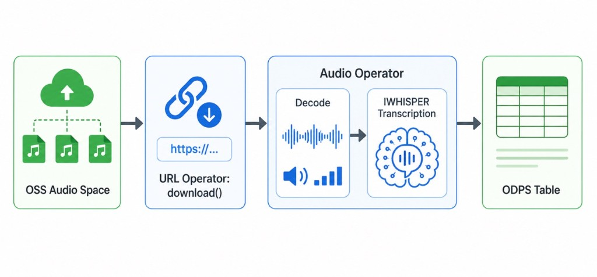

.. _examples_multimodal_audio_maxframe:

MaxFrame Multimodal Audio Operator Practice
===========================================

.. raw:: html

   
Available at MaxFrame 2.7.0

Background
----------

As multimodal foundation models and speech applications grow quickly, audio becomes a key data source for training and content understanding. Workloads such as ASR, subtitle generation, speech retrieval, and corpus preparation all require reliable text extraction from large-scale raw audio.

In production, audio files are usually scattered across storage locations with inconsistent formats, durations, and quality. Traditional pipelines rely on many separate tools for download, transcoding, transcription, and aggregation, which increases development and operational complexity at scale.

With MaxCompute + MaxFrame, you can run a unified distributed pipeline from OSS audio ingestion to structured transcription output. This tutorial focuses on practical audio processing with built-in MaxFrame ``.audio`` operators.

Use cases
---------

- **Speech transcription** for podcasts, courses, interviews, and meeting recordings.
- **Subtitle generation** and text extraction from audio tracks in media files.
- **Training data preparation** for speech recognition and speech understanding models.
- **Structured processing** for customer service calls and business recordings.

Pipeline
--------

Prerequisites
-------------

.. list-table::
   :header-rows: 1
   :widths: 8 24 68

   * - #
     - Requirement
     - Description
   * - 1
     - **MaxCompute enabled**
     - A MaxCompute project with valid Access ID / Access Key.
   * - 2
     - **DPE enabled**
     - ``.url.download()`` and ``.audio.*`` operators run on DPE.
   * - 3
     - **Audio uploaded to OSS**
     - Source audio files are available in a target OSS bucket.
   * - 4
     - **OSS RAM role authorization**
     - Configure Role ARN for ``.url.download(storage_options={"role_arn": ...})``.
   * - 5
     - **MaxFrame SDK version**
     - Use MaxFrame SDK **2.7.0** or above (``pip install maxframe>=2.7.0``).

Configure OSS RAM role
----------------------

When using ``.url.download(storage_options={"role_arn": ...})``, MaxFrame reads OSS data by assuming a RAM role. Make sure:

1. The role has OSS read permission (for example ``AliyunOSSReadOnlyAccess``).
2. The role trust policy allows MaxCompute service to assume the role.

Environment setup
-----------------

MaxCompute placeholders:

.. code-block:: python

   ODPS_ACCESS_ID = "<REDACTED_ACCESS_ID>"
   ODPS_ACCESS_KEY = "<REDACTED_ACCESS_KEY>"
   ODPS_PROJECT = "<REDACTED_PROJECT>"
   ODPS_ENDPOINT = "<REDACTED_ENDPOINT>"
   OUTPUT_TABLE = "<REDACTED_OUTPUT_TABLE>"

OSS placeholders:

.. code-block:: python

   ROLE_ARN = "<REDACTED_ROLE_ARN>"
   OSS_ENDPOINT = "<REDACTED_OSS_ENDPOINT>"
   OSS_BUCKET_NAME = "<REDACTED_OSS_BUCKET_NAME>"
   OSS_DATA_PREFIX = "<REDACTED_OSS_DATA_PREFIX>"

Complete code example
---------------------

Initialize ODPS and MaxFrame session:

.. code-block:: python

   import maxframe

   assert maxframe.__version__ >= "2.7.0", (
       f"maxframe >= 2.7.0 is required, current version: {maxframe.__version__}. "
       f"Please run: pip install --upgrade maxframe"
   )
   print(f"maxframe version: {maxframe.__version__} ✓")

   import pandas as pd
   import maxframe.dataframe as md
   from maxframe import new_session
   from maxframe.config import options
   from odps import ODPS

   o = ODPS(
       access_id=ODPS_ACCESS_ID,
       secret_access_key=ODPS_ACCESS_KEY,
       project=ODPS_PROJECT,
       endpoint=ODPS_ENDPOINT,
   )

   options.sql.enable_mcqa = False
   options.dag.settings = {"engine_order": ["DPE"]}

   session = new_session(o)
   print(f"Session ID : {session.session_id}")
   print(f"LogView    : {session.get_logview_address()}")

Build OSS audio URL list:

.. code-block:: python

   file_names = ["audio_011.flac"]
   audio_urls = [
       f"oss://{OSS_ENDPOINT}/{OSS_BUCKET_NAME}/{OSS_DATA_PREFIX}{name}"
       for name in file_names
   ]
   print(f"Processing {len(audio_urls)} audio files:")
   for u in audio_urls:
       print(f"  - {u}")

Use ``.audio`` operators for decode, language detection, transcription, and VAD:

.. code-block:: python

   df = md.DataFrame(pd.DataFrame({"name": file_names, "url": audio_urls}))

   # Download OSS audio as bytes via RAM role
   df["audio_bytes"] = df["url"].url.download(
       storage_options={"role_arn": ROLE_ARN},
       errors="raise",
   )

   # Decode to target sample rate
   df["decoded"] = df["audio_bytes"].audio.decode(target_sample_rate=16000)

   # Basic properties
   df["sample_rate"] = df["decoded"].audio.sample_rate
   df["duration"] = df["decoded"].audio.duration
   df["format"] = df["decoded"].audio.format

   # Language detection
   df["language"] = df["audio_bytes"].audio.detect_language(
       max_duration_sec=30.0,
       cpu=4,
       memory="16GiB",
   )

   # Speech-to-text
   transcribed = df["audio_bytes"].audio.transcribe(cpu=4, memory="16GiB")
   df["text"] = transcribed["text"]

   # Voice activity detection
   df["vad"] = df["audio_bytes"].audio.vad_detect(threshold=0.5)

   result_df = df[[
       "name",
       "sample_rate",
       "duration",
       "format",
       "language",
       "text",
       "vad",
   ]]
   md.to_odps_table(result_df, OUTPUT_TABLE, overwrite=True).execute()
   print(result_df.execute().fetch())

Cleanup:

.. code-block:: python

   session.destroy()

Technical highlights
--------------------

- **Direct OSS ingestion** with ``.url.download()`` and no object table dependency.
- **Built-in distributed audio operators** for decode, metadata, language detection, transcription, and VAD.
- **Flexible resource control** for CPU/GPU style workloads through operator and engine parameters.
- **Low operational overhead** by reusing MaxCompute elastic compute and storage stack.

Troubleshooting
---------------

OSS access denied
~~~~~~~~~~~~~~~~~

**Symptom**: ``.url.download(storage_options={"role_arn": ...})`` fails with an access denied error.

**Cause**: Wrong or missing role permissions.

**Solution**: Verify the following:

1. **Role ARN is correct** — double-check the ``role_arn`` value in ``storage_options`` matches the RAM role configured in the Alibaba Cloud console.
2. **OSS read permission** — ensure the RAM role has the ``AliyunOSSReadOnlyAccess`` policy (or equivalent custom policy) attached, granting ``oss:GetObject`` permission on the target bucket.
