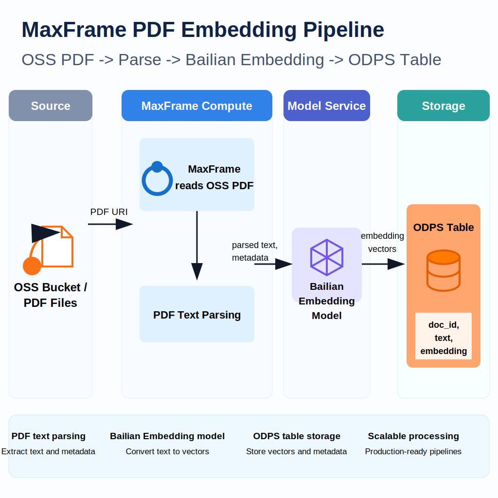

.. _examples_pdf_text_embedding:

PDF Text Parsing and Bailian Embedding
======================================

.. raw:: html

   
Available at MaxFrame 2.6.0

Background
----------

Papers, contracts, research reports, product manuals, white papers, and other
PDF files carry a large amount of unstructured business knowledge. Raw PDFs
often have diverse layouts, varying lengths, and no semantic splitting, which
makes them hard to use directly for semantic retrieval, RAG question answering,
document classification, and other downstream scenarios.

This best practice shows how to run a distributed PDF preprocessing pipeline on
MaxFrame and the MaxCompute DPE engine: extract text from PDFs, split the text
into semantic chunks, generate sentence embeddings with the Bailian
``text-embedding-v4`` model, and write the resulting feature table back to
MaxCompute.

Applicable scenarios
--------------------

- Document knowledge base RAG question answering.
- Semantic retrieval over papers, contracts, and research reports.
- Enterprise document classification and clustering.
- Duplicate document and near-duplicate paragraph detection.
- Text feature asset construction for retrieval, analytics, and data feedback loops.

Core workflow
-------------

Prerequisites
-------------

.. list-table::
   :header-rows: 1
   :widths: 8 24 68

   * - #
     - Requirement
     - Description
   * - 1
     - **MaxCompute enabled**
     - A MaxCompute project with valid Access ID / Access Key.
   * - 2
     - **DPE engine enabled**
     - PDF parsing UDFs and ``apply_chunk`` run on DPE.
   * - 3
     - **PDFs uploaded to OSS**
     - Source PDFs are uploaded to a target OSS bucket.
   * - 4
     - **OSS RAM role authorization**
     - MaxFrame reads PDFs through OSS file mount, which requires a configured Role ARN.
   * - 5
     - **Model Compute Service purchased**
     - Calling MaxCompute managed embedding models requires Model Compute Service to host inference traffic.
   * - 6
     - **MaxFrame SDK version**
     - Use MaxFrame SDK **2.6.0** or above (``pip install maxframe>=2.6.0``).

Environment setup
-----------------

Configure ODPS credentials, OSS access, and the embedding model. Replace all
placeholder values with your project-specific settings.

.. code-block:: python

   ODPS_ACCESS_ID = "<your_access_id>"
   ODPS_ACCESS_KEY = "<your_access_key>"
   ODPS_PROJECT = "<your_mc_project>"
   ODPS_ENDPOINT = "https://service.<region>.maxcompute.aliyun.com/api"
   OUTPUT_TABLE = "document_embedding_pipeline_results"

   OSS_BUCKET_NAME = "<your_oss_bucket>"
   OSS_ENDPOINT = "oss-<region>.aliyuncs.com"
   OSS_DATA_PREFIX = "documents"
   OSS_STORAGE_OPTIONS = {"role_arn": "<your_role_arn>"}

   EMBED_MODEL_ID = "text-embedding-v4"
   EMBED_MODEL_PROJECT = "bigdata_public_modelset"

   CHUNK_SIZE = 2048
   CHUNK_OVERLAP = 200

Open a MaxFrame session on DPE:

.. code-block:: python

   import maxframe
   import pandas as pd
   import maxframe.dataframe as md
   from maxframe import new_session
   from maxframe.config import options
   from maxframe.udf import with_fs_mount, with_python_requirements, with_running_options
   from odps import ODPS

   o = ODPS(
       access_id=ODPS_ACCESS_ID,
       secret_access_key=ODPS_ACCESS_KEY,
       project=ODPS_PROJECT,
       endpoint=ODPS_ENDPOINT,
   )

   options.dag.settings = {
       "engine_order": ["DPE"],
       "unavailable_engines": ["MCSQL", "SPE"],
   }
   options.session.gu_quota_name = "<your_gu_quota_name>"

   session = new_session(o)
   print(f"Session ID : {session.session_id}")
   print(f"LogView    : {session.get_logview_address()}")

Step 1. Prepare PDF paths
-------------------------

Provide PDF paths relative to the OSS bucket. The UDF mounts the bucket to
``/mnt/oss`` and opens each file as ``/mnt/oss/<pdf_path>``.

.. code-block:: python

   PDF_PATHS = [
       "documents/attention_is_all_you_need.pdf",
       "documents/bert.pdf",
       "documents/gpt3.pdf",
       "documents/llama.pdf",
       "documents/llama2.pdf",
   ]

   paths_df = md.DataFrame(pd.DataFrame({"pdf_path": PDF_PATHS}))

Step 2. Parse PDFs and split into chunks
----------------------------------------

The UDF has a single responsibility: use ``pymupdf`` to extract page text and
``RecursiveCharacterTextSplitter`` to split by paragraph and sentence
boundaries. The output schema is ``pdf_path``, ``page_number``, and
``chunk_text``.

.. code-block:: python

   @with_python_requirements("pymupdf", "langchain-text-splitters")
   @with_running_options(engine="dpe", cpu=8, memory=16)
   @with_fs_mount(
       f"oss://{OSS_ENDPOINT}/{OSS_BUCKET_NAME}/",
       "/mnt/oss",
       storage_options=OSS_STORAGE_OPTIONS,
   )
   def extract_chunks(chunk):
       """Extract text and chunk each PDF into row-level records."""
       import os

       import pymupdf
       from langchain_text_splitters import RecursiveCharacterTextSplitter

       splitter = RecursiveCharacterTextSplitter(
           chunk_size=CHUNK_SIZE,
           chunk_overlap=CHUNK_OVERLAP,
           separators=["\n\n", "\n", "。", "！", "？", ". ", "! ", "? ", " ", ""],
           keep_separator=True,
       )

       rows = []
       for pdf_path in chunk["pdf_path"].tolist():
           doc = pymupdf.Document(os.path.join("/mnt/oss", pdf_path))
           for page in doc:
               page_text = page.get_text()
               if not page_text or not page_text.strip():
                   continue
               for chunk_text in splitter.split_text(page_text):
                   rows.append(
                       {
                           "pdf_path": pdf_path,
                           "page_number": page.number,
                           "chunk_text": chunk_text,
                       }
                   )

       return pd.DataFrame(
           rows,
           columns=["pdf_path", "page_number", "chunk_text"],
       )

   chunks_df = paths_df.mf.apply_chunk(
       extract_chunks,
       output_type="dataframe",
       dtypes=pd.Series(
           {
               "pdf_path": "object",
               "page_number": "int64",
               "chunk_text": "object",
           }
       ),
   )

   chunks_df.execute().fetch()

Step 3. Generate embeddings with Bailian
----------------------------------------

Use ``read_odps_model`` to load the public Bailian ``text-embedding-v4`` model
from MaxCompute and generate embeddings for the ``chunk_text`` column in batch.
The embedding call is fully managed by MaxCompute Model Compute Service.

.. code-block:: python

   available_models = list(o.list_models(project=EMBED_MODEL_PROJECT))
   [m.name for m in available_models if m.name == EMBED_MODEL_ID]

.. code-block:: python

   from maxframe.learn.utils import read_odps_model

   llm = read_odps_model(EMBED_MODEL_ID, project=EMBED_MODEL_PROJECT)
   embeddings = llm.embed(
       chunks_df["chunk_text"],
       running_options={"max_tokens": 1024, "verbose": True},
       # By default the response DataFrame includes provider response
       # metadata. ``simple_output=True`` returns the embedding data directly.
       simple_output=True,
   )

   # Use the ``response`` column as the raw embedding JSON.
   result_df = chunks_df.assign(embedding=embeddings["response"])
   result_df.execute().fetch()

Step 4. Convert embedding JSON
------------------------------

Bailian ``embed()`` returns a JSON string such as
``{"data": [{"embedding": [...]}], ...}``. Convert it to a flat float-array JSON
string so downstream retrieval and similarity jobs can read the vector column
directly.

.. code-block:: python

   def parse_embedding(s):
       """Extract the raw Bailian embedding JSON as a flat float-array JSON string."""
       import json

       if s is None:
           return None
       return json.dumps(json.loads(s)["data"][0]["embedding"])

   result_df = result_df.assign(
       embedding=result_df["embedding"].map(parse_embedding, dtype="object")
   )

   result_df["embedding"].execute().fetch()

Step 5. Write the result table
------------------------------

Persist the processed chunks and embeddings to MaxCompute.

.. code-block:: python

   md.to_odps_table(result_df, OUTPUT_TABLE, overwrite=True).execute()
   print(f"Result written to {OUTPUT_TABLE}")

When the job is finished, release the MaxFrame session:

.. code-block:: python

   session.destroy()

Troubleshooting
---------------

.. list-table::
   :header-rows: 1
   :widths: 34 33 33

   * - Issue
     - Cause
     - Solution
   * - ``Engine DPE not available``
     - DPE is not enabled for the project.
     - Contact the administrator to enable the DPE engine.
   * - ``OSS access denied``
     - RAM role is misconfigured.
     - Verify ``role_arn`` and confirm the RAM role has OSS read permission.
   * - ``pymupdf`` fails to read a PDF
     - The PDF file is corrupted or encrypted.
     - Pre-filter unreadable PDFs, or catch exceptions in the UDF and skip failed files.
   * - Write-table failure or column-type error
     - ``apply_chunk`` dtypes do not match the target schema.
     - Align ``pdf_path``, ``page_number``, ``chunk_text``, and ``embedding`` column types.
   * - ``gu_quota`` unavailable
     - The quota and MaxCompute project are in different regions.
     - Make sure ``ODPS_ENDPOINT`` and ``options.session.gu_quota_name`` use the same region.
