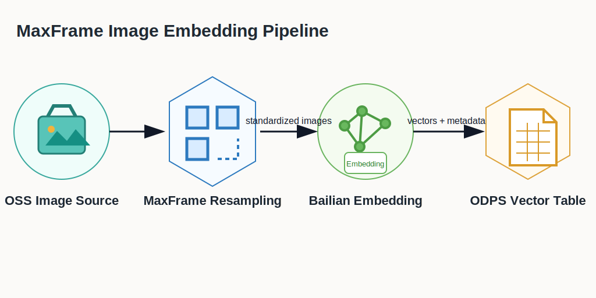
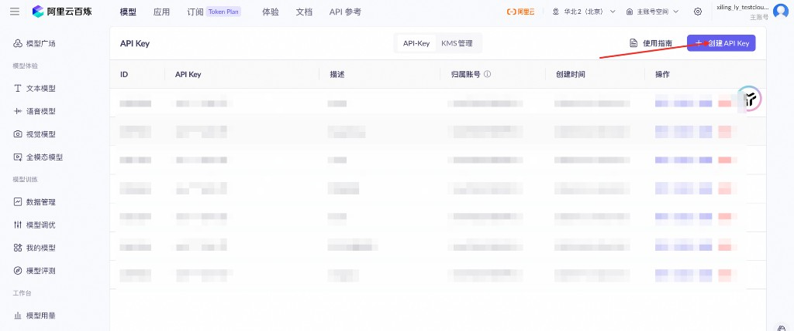

.. _examples_qwen3_vl_oss_embedding:

Multimodal Image Feature Pipeline with MaxFrame
===============================================

.. raw:: html

   
Available at MaxFrame 2.6.0

Background
----------

Enterprise data platforms increasingly rely on multimodal data such as images, text, audio, and video. These data assets are often heterogeneous and unstructured, making them difficult to use directly for search, recommendation, moderation, clustering, and analytics.

A practical pattern is to standardize the pipeline: download and decode raw files, normalize formats, run semantic understanding, generate labels, extract embeddings, and store vectors in a reusable feature table.

This tutorial demonstrates a multimodal image feature pipeline on MaxFrame: distributed image preprocessing, semantic embedding inference, and table persistence for downstream retrieval, recommendation, moderation, clustering, and analytics.

Applicable scenarios
--------------------

- Multimodal retrieval and similar-content recall.
- Feature generation for recommendation and ranking systems.
- Content understanding, moderation, and quality analysis.
- Deduplication and clustering using vector similarity.
- Reusable feature asset construction for enterprise data governance.
- Data preparation for RAG, knowledge base, and agent applications.

Core workflow
-------------

Prerequisites
-------------

.. list-table::
   :header-rows: 1
   :widths: 8 24 68

   * - #
     - Requirement
     - Description
   * - 1
     - **MaxCompute enabled**
     - A MaxCompute project with valid Access ID / Access Key.
   * - 2
     - **DPE enabled**
     - Image operators and ``apply_chunk`` run on DPE.
   * - 3
     - **Images uploaded to OSS**
     - Create your own OSS bucket and upload the five sample images used by this tutorial.
   * - 4
     - **OSS RAM role authorization**
     - Configure Role ARN for OSS read access.
   * - 5
     - **DashScope API key**
     - Create an API key for multimodal embedding calls.
   * - 6
     - **MaxFrame SDK version**
     - Use MaxFrame SDK **2.6.0** or above (``pip install maxframe>=2.6.0``).

Configure OSS RAM role
----------------------

Refer to the service enablement and authorization section in
`OSS mounting and use practices <https://help.aliyun.com/zh/maxcompute/user-guide/oss-mounting-and-use-practices>`__
to create an OSS bucket and a RAM role with OSS read permission. In this
example, the code only needs the RAM role ARN passed through ``with_fs_mount``
as ``storage_options={"role_arn": ROLE_ARN}``.

The service-linked-role step shown in the console guide is not used by this
example. If your MaxCompute service has already been enabled, focus on the RAM
role and OSS permission configuration needed by ``role_arn``.

Get DashScope API key
---------------------

Create or manage your API key in DashScope console:
`DashScope API Key management <https://bailian.console.aliyun.com/cn-beijing?tab=model#/api-key>`__.

Environment setup
-----------------

.. code-block:: python

   import maxframe

   assert maxframe.__version__ >= "2.6.0", (
       f"maxframe >= 2.6.0 is required, current version: {maxframe.__version__}. "
       f"Please run: pip install --upgrade maxframe"
   )

   import pandas as pd
   import maxframe.dataframe as md
   from maxframe import new_session
   from maxframe.udf import with_python_requirements, with_fs_mount
   from maxframe.config import options
   from odps import ODPS

   pd.set_option("display.max_colwidth", None)
   pd.set_option("display.max_columns", None)

   options.dag.settings = {"engine_order": ["DPE", "MCSQL"]}
   options.dpe.settings = {
       "substep.internal_network_whitelist": [
           "intranet-cn-beijing.dashscope.aliyuncs.com:443",
       ],
   }

   DASHSCOPE_API_KEY = "<your_dashscope_api_key>"
   ROLE_ARN = "acs:ram::<your_account_id>:role/<your_role_name>"
   OSS_ENDPOINT = "<your_oss_endpoint>"  # for example: oss-cn-hangzhou.aliyuncs.com
   OSS_BUCKET = "<your_oss_bucket>"
   OSS_IMAGE_PREFIX = "maxframe-image-demo/"

   o = ODPS(
       access_id="<your_access_id>",
       secret_access_key="<your_access_key_secret>",
       project="<your_mc_project>",
       endpoint="https://service.<region>.maxcompute.aliyun.com/api",
   )
   session = new_session(o)
   print(f"Session ID : {session.session_id}")
   print(f"LogView    : {session.get_logview_address()}")

1. Build input dataset
----------------------

Upload these five images to ``oss://<your_oss_endpoint>/<your_oss_bucket>/maxframe-image-demo/``
before running this section. The names in ``IMAGE_FILES`` must exactly match
the objects in your OSS bucket.

.. code-block:: python

   IMAGE_FILES = ["img_001.jpg", "img_002.jpg", "img_003.jpg", "img_004.png", "img_005.jpg"]

   df = md.DataFrame({
       "id": list(range(1, len(IMAGE_FILES) + 1)),
       "filename": IMAGE_FILES,
   })

   # Production path:
   # df = md.read_odps_table("your_image_table", columns=["id", "filename"])

2. Download, decode, and resize images
--------------------------------------

.. code-block:: python

   @with_fs_mount(
       path=f"oss://{OSS_ENDPOINT}/{OSS_BUCKET}/{OSS_IMAGE_PREFIX}",
       mount_path="/mnt/oss_data",
       storage_options={"role_arn": ROLE_ARN},
   )
   @with_python_requirements("Pillow==10.4.0")
   def download_and_process(filename_series, target_size=(512, 512)):
       import io
       import base64
       import pandas as pd
       from PIL import Image

       results = []
       widths, heights, formats = [], [], []
       for fname in filename_series:
           try:
               img_path = f"/mnt/oss_data/{fname}"
               img = Image.open(img_path)
               widths.append(img.width)
               heights.append(img.height)
               formats.append(img.format)

               img = img.convert("RGB").resize(target_size, Image.LANCZOS)
               buf = io.BytesIO()
               img.save(buf, format="JPEG", quality=85)
               results.append(base64.b64encode(buf.getvalue()).decode("utf-8"))
           except Exception:
               results.append(None)
               widths.append(None)
               heights.append(None)
               formats.append(None)

       return pd.DataFrame(
           {
               "width": widths,
               "height": heights,
               "format": formats,
               "img_base64": results,
           },
           index=filename_series.index,
       )

   result_df = df["filename"].mf.apply_chunk(
       download_and_process,
       output_type="dataframe",
       dtypes={
           "width": "float64",
           "height": "float64",
           "format": "object",
           "img_base64": "object",
       },
       skip_infer=True,
       target_size=(512, 512),
   )

   df["width"] = result_df["width"]
   df["height"] = result_df["height"]
   df["format"] = result_df["format"]
   df["img_base64"] = result_df["img_base64"]
   df = df.execute()

3. Multimodal embedding inference
---------------------------------

.. note::

   For large-scale production workloads, request higher API concurrency limits to avoid 429/403 throttling.
   If the task times out, open LogView first and check whether OSS mount,
   image file names, RAM role permissions, and DashScope network access are all valid.

.. code-block:: python

   @with_python_requirements("dashscope>=1.24.6")
   def embed_images(base64_series, api_key=None, max_retries=3):
       import time
       import pandas as pd
       import dashscope
       from dashscope import MultiModalEmbedding

       dashscope.api_key = api_key
       dashscope.base_http_api_url = "https://intranet-cn-beijing.dashscope.aliyuncs.com/api/v1"

       results = []
       for b64_str in base64_series:
           if not b64_str:
               results.append(None)
               continue
           for attempt in range(max_retries):
               resp = MultiModalEmbedding.call(
                   model="tongyi-embedding-vision-flash-2026-03-06",
                   input=[{"image": f"data:image/jpeg;base64,{b64_str}"}],
               )
               if resp.status_code == 200:
                   results.append(resp.output["embeddings"][0]["embedding"])
                   break
               if attempt < max_retries - 1:
                   time.sleep(2**attempt)
               else:
                   results.append(None)

       return pd.Series(results, index=base64_series.index)

   df["embedding"] = df["img_base64"].mf.apply_chunk(
       embed_images,
       output_type="series",
       dtype="object",
       skip_infer=True,
       batch_rows=5,
       index=df["img_base64"].index,
       api_key=DASHSCOPE_API_KEY,
   )

   df = df.execute()
   print(df.fetch())

4. Persist embeddings to MaxCompute
-----------------------------------

.. code-block:: python

   md.to_odps_table(
       md.DataFrame(df),
       "image_embedding_result",
       overwrite=True,
   ).execute()

   print("Results written to table: image_embedding_result")

5. Cleanup
----------

.. code-block:: python

   print(f"LogView: {session.get_logview_address()}")
   session.destroy()
   print("Session destroyed.")

Troubleshooting
---------------

.. list-table::
   :header-rows: 1
   :widths: 28 32 40

   * - Issue
     - Cause
     - Resolution
   * - ``Engine DPE not available``
     - DPE is not enabled
     - Ask admin to enable DPE in project.
   * - ``OSS access denied``
     - Wrong or missing role permissions
     - Verify ``role_arn`` and OSS read permissions.
   * - ``dashscope API 401``
     - Invalid API key
     - Check API key status in DashScope console.
   * - Embedding is ``None``
     - Per-image inference failure
     - Verify image integrity and base64 generation.
   * - Inconsistent vector dimensions
     - Different embedding models were mixed
     - Use one embedding model per batch/output table.
